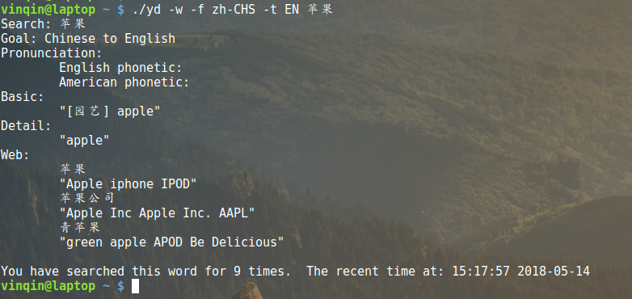
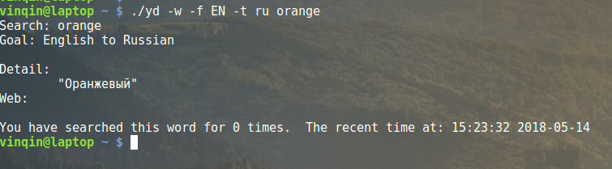
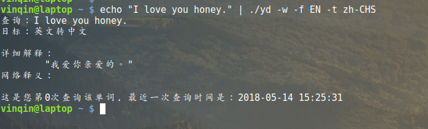

# youdao
A Linux translate tool based on JRE8, MySQL5.7 and Bash.

## Introduction

This is an international translate tool which works in a bash environment. It uses the `Youdao`[^noa] online API translate service and local `mysql` server to support a personal translate service. The tool can translate nine languages including English, Simplified Chinese, Japanese, Korean,  French, Russian, Portuguese, Spanish and Vietnamese from one to another one.

## Preinstall

1. Install JRE1.8 or above.
2. Install MySQL5.7+
3. [optional] Install`sox`(a multimedia player) and it's corresponding media library if you are going to play the pronunciation of translations.

## Install

Download the script `yd` and jar file `Youdao-3.1.0-SNAPSHOT.jar` within setup directory and put them in the same directory.

## Usage

```bash
Usage: translate [OPTION]... [WORD]...
Translate words from specified language type to specified language type(the default language type is auto).

Description:
     -F FILE, the sourced file.
	The file contains what you want to translate.
     -f TYPE, the sourced language type.
	It can be zh-CHS(Simplified Chinese), ja(Japanese), EN(English),
	ko(Korean), fr(French), ru(Russian), pt(Portuguese), es(Spanish) or vi(Vietnamese).
	It can auto detect the sourced language type if you do not set the sourced language type.
     -t TYPE, the targeted language type.
	It can be zh-CHS(Simplified Chinese), ja(Japanese), EN(English),
	ko(Korean), fr(French), ru(Russian), pt(Portuguese) or es(Spanish) or vi(Vietnamese).
	It can auto detect the targeted language type if you do not set the targeted language type.
     -w Enable the web translation.
     -p Enable sox to play the basic pronunciation. Basic pronunciation can be uk or us.
     -v Choose the voice type of basic pronunciation, 0 stands for female voice and 1 for male.
	Defualt voice is female and you need enable option p before choose this voice type.
     -S Enable sox to play the query information.
     -T Enable sox to play the results of translation.
     -h Print this help information.

```

## Sample








------

[^noa]: Youdao is a subsidiary of Netease (a Chinese Internet technology company) that use big data technology to provide mobile Internet applications.